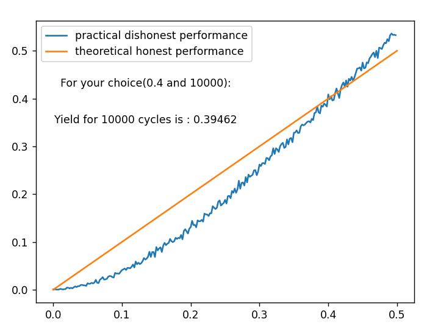
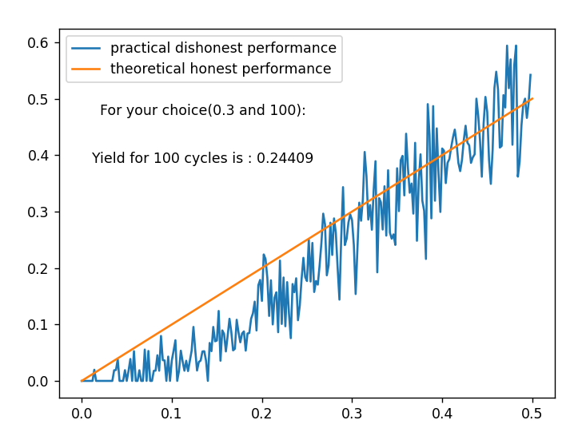
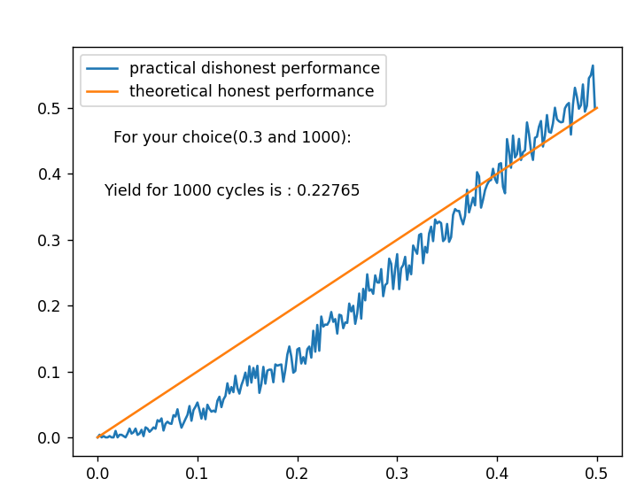

# Cryptofinance

## **1 + 2** <a name="1_+_2"/>
This script will simulate a "1 + 2" attack. This attack consists in discovering as many blocks as possible on a cycle of 3 blocks 
To simulate this attack we take as parameters :
* q, the relative mining power of the attacker
* n, the number of attack cycles

When we plot the profitability as a function of the relative mining power we obtain this graph:

If we use fewer cycles then we see that 42% is still the solution but that it is possible to be unprofitable always because of the spikes:

We see that the attack is profitable when you have 42% of the total bitcoin mining power

## **Selfish mining** <a name="Selfish_mining"/>

## **Simulation of mining** <a name="Simulation_mining"/>