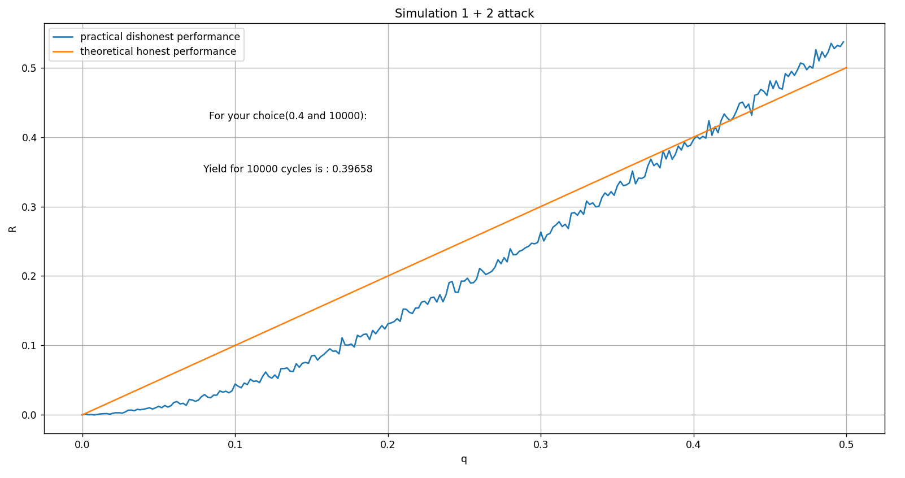

# Cryptofinance

## **1 + 2** <a name="1_+_2"/>
This script will simulate a "1 + 2" attack. This attack consists in discovering as many blocks as possible on a cycle of 3 blocks 
To simulate this attack we take as parameters :
* q, the relative mining power of the attacker
* n, the number of attack cycles

When we plot the profitability as a function of the relative mining power we obtain this graph:

If we use fewer cycles then we see that 42% is still the solution but that it is possible to be unprofitable always because of the spikes:

We see that the attack is profitable when you have 42% of the total bitcoin mining power

## **Selfish mining** <a name="Selfish_mining"/>

This script will simulate an attack called "Selfish mining" which consists in mining without revealing immediately its blocks. The attacker will mine in secret until he gets caught by the official blockchain or until he stops the attack. The attack ends when the selfish miner releases his blocks or when he gives up. To simulate this attack we take as parameters :

* n, the number of attack cycles
* q, the relative mining power of the attacker
* &gamma;, the connectivity = 20%.

When we plot the profitability as a function of the relative mining power we obtain this graph:

With 33% of the hash power we are winning to be dishonest

## **Simulation of mining** <a name="Simulation_mining"/>